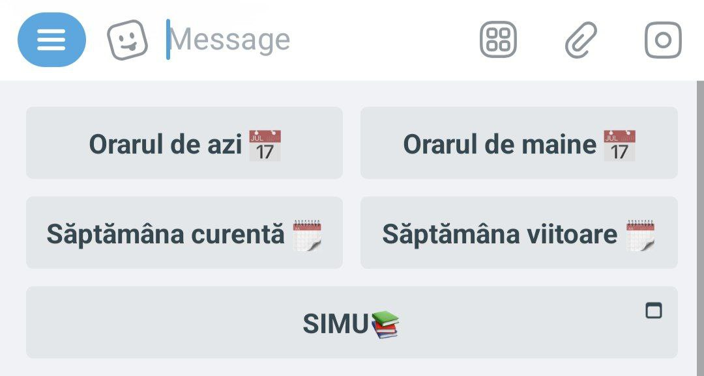
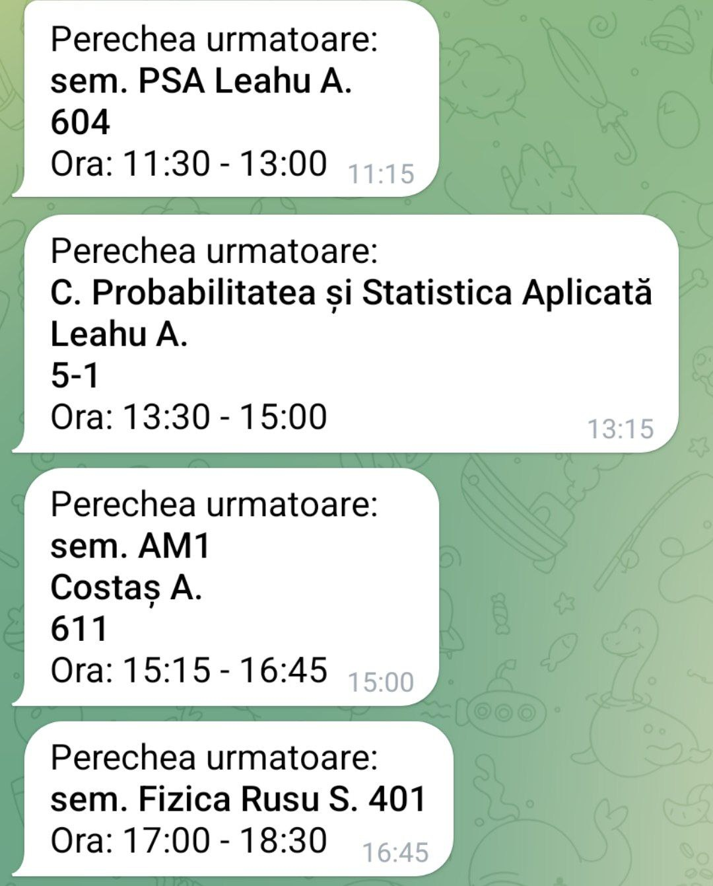
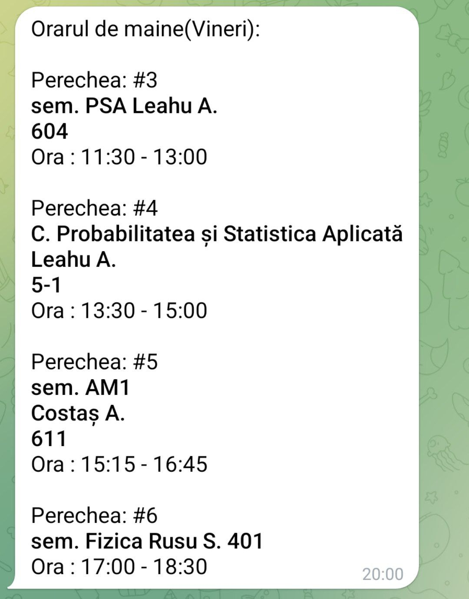

# 📅 ORAR_UTM_FCIM_BOT

ORAR_UTM_FCIM_BOT is a Telegram bot made for UTM students to simplify access to their class schedules.

## 📋 Table of Contents
- [✨ Features](#-features)
  - [🎛️ Keyboard Buttons](#️-keyboard-buttons)
  - [🔔 Notifications](#-notifications)
- [📖 Usage Guide](#-usage-guide)
  - [Getting Started](#getting-started)
  - [Common Commands](#common-commands)
- [📜 Changelog](CHANGELOG.md)
- [💻 Run](RUN.md)
- [📄 License](#-license)

## ✨ Features

### 🎛️ Keyboard Buttons

Use these buttons to instantly access different parts of your schedule:

- **Orarul de azi 📅** - Get today's schedule, including times and cabinets.
- **Orarul de maine 📅** - See tomorrow's schedule.
- **Săptămâna curentă 🗓️** - View the schedule for the current week.
- **Săptămâna viitoare 🗓️** - View the schedule for next week.
- **SIMU📚** - Quick access to the student portal.

### 🔔 Notifications

Enable notifications at the start or use the `/notifon` command to receive:

- **Next class alert**: A notification 15 minutes before your next class(according to your subgroup, if you chose one), showing:
  - Class name
  - Professor name
  - Cabinet number
  - Class times

- **Next day alert**: At 20:00, the bot sends the schedule for the following day.

## 📖 Usage Guide

### Getting Started
1. Start the bot by sending `/start`
2. Select your group using `/choose_gr`
3. Optionally select subgroup with `/choose_subgr`
4. Enable notifications with `/notifon`

### Common Commands

#### General Commands
- `/start` - Initialize the bot and choose notifications
- `/help` - Display available commands
- `/contacts` - Get developer contact info
- `/version` - Check bot version
- `/donations` - Donation information

#### Schedule Commands
- `/today` - Today's schedule
- `/tomorrow` - Tomorrow's schedule
- `/hours` - Schedule of hours (class periods + breaks)
- `/curr_week` - Schedule for the current week
- `/next_week` - Schedule for next week

#### Settings Commands
- `/choose_gr` - Select your group
- `/choose_subgr` - Select your subgroup
- `/notifon` - Turn on notifications
- `/notifoff` - Turn off notifications

#### Admin Commands
- `/admin_help` - Display admin commands
- `/stats` - View usage statistics
- `/backup` - Manual database backup
- `/use_backup` - Restore database from latest backup
- `/new_year` - Update all users' year (+1)
- `/message` - Send message to users
- `/ban` - Ban a user
- `/unban` - Unban a user
- `/list_ban` - List banned users

## 📄 License

This project is available as open source under the terms of the MIT License.