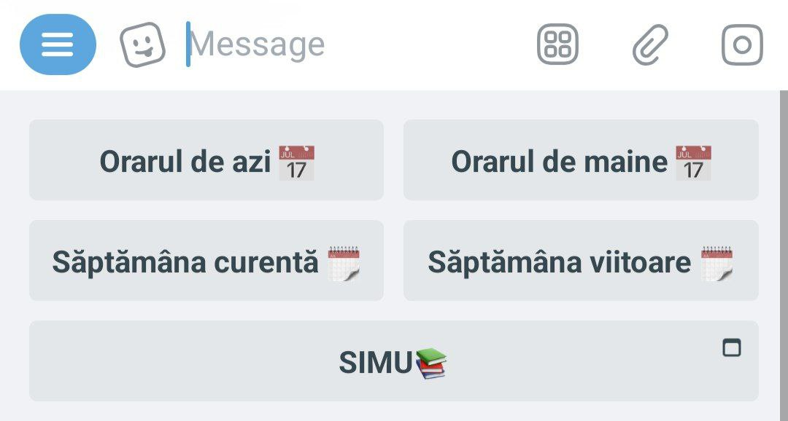
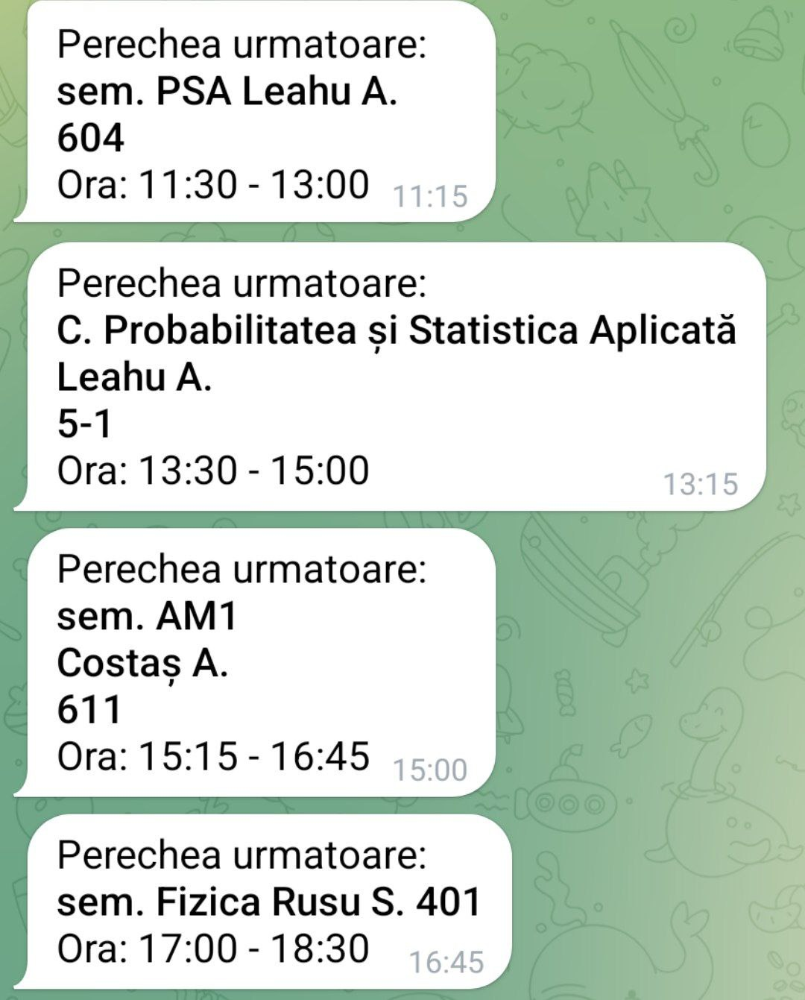
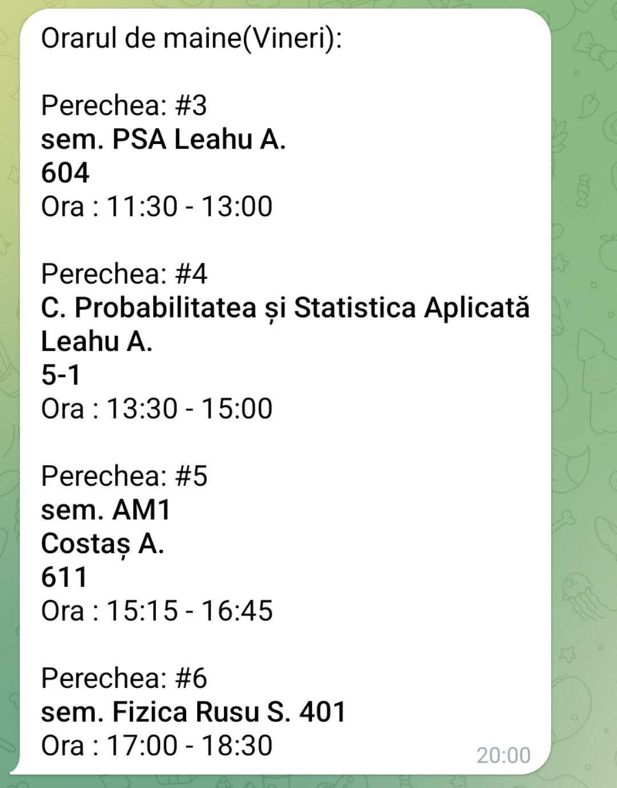

# 📅 ORAR_UTM_FCIM_BOT

ORAR_UTM_FCIM_BOT is a Telegram bot made for UTM students to simplify access to their class schedules.

Supports Romanian, Russian, and English. See [0.15.0 release notes](CHANGELOG.md)
for latest changes and [RUN.md](RUN.md) for installation and upgrades.

## 📋 Table of Contents
- [✨ Features](#-features)
  - [🎛️ Keyboard Buttons](#️-keyboard-buttons)
  - [🔔 Notifications](#-notifications)
  - [Emoji display](#emoji-display)
- [📖 Usage Guide](#-usage-guide)
  - [Getting Started](#getting-started)
  - [Common Commands](#common-commands)
- [📜 Changelog](CHANGELOG.md)
- [💻 Run](RUN.md)
- [📄 License](#-license)

## ✨ Features

### 🎛️ Keyboard Buttons

Use these buttons to instantly access different parts of your schedule:

- **Orarul de azi 📅** - Get today's schedule, including times and cabinets.
- **Orarul de maine 📅** - See tomorrow's schedule.
- **Săptămâna curentă 🗓️** - View the schedule for the current week.
- **Săptămâna viitoare 🗓️** - View the schedule for next week.
- **SIMU📚** - Quick access to the student portal.

### 🔔 Notifications

Enable notifications at the start or use the `/notifon` command to receive:

- **Next class alert**: A notification 15 minutes before your next class(according to your subgroup, if you chose one), showing:
  - Class name
  - Professor name
  - Cabinet number
  - Class times

- **Next day alert**: At 20:00, the bot sends the schedule for the following day.

Times use Europe/Chisinau. Bulk delivery begins one minute early and is paced at
15 messages per second; arrivals vary by recipient. Both alert types respect
`/notifon` and `/notifoff`, and administrators can pause them with Holiday Mode.

### Emoji display

Use `/emoji` to switch display mode. Its preview shows the current setting and
updates when you press the toggle. The preference also applies to `/hours` and
both reminder types, survives restarts, and does not change menu/status emojis.

Existing users start OFF; new users default ON. With a matching classification
sidecar, subjects, teachers, and rooms receive separate symbols. Lectures use 🎙️,
seminars use 📖, and lab markers distinguish whole/half groups. Missing or uncertain
classifications keep original text. You can switch back at any time.

## 📖 Usage Guide

### Getting Started
1. Start the bot by sending `/start`
2. Select your group using `/choose_gr`
3. Optionally select subgroup with `/choose_subgr`
4. Enable notifications with `/notifon`
5. Optionally switch language with `/language` or display mode with `/emoji`

### Common Commands

#### General Commands
- `/start` - Initialize the bot and choose notifications
- `/help` - Display available commands
- `/contacts` - Get developer contact info
- `/version` - Compare local/published schedule versions and show repository version/date information
- `/donations` - Donation information

#### Schedule Commands
- `/today` - Today's schedule
- `/tomorrow` - Tomorrow's schedule
- `/hours` - Schedule of hours (class periods + breaks)
- `/curr_week` - Schedule for the current week
- `/next_week` - Schedule for next week

#### Settings Commands
- `/language` - Choose Romanian, Russian, or English
- `/emoji` - Preview and toggle schedule emoji display
- `/choose_gr` - Select your group
- `/choose_subgr` - Select your subgroup
- `/notifon` - Turn on notifications
- `/notifoff` - Turn off notifications

#### Admin Commands
- `/admin_help` - Display admin commands
- `/stats` - View usage statistics
- `/activity [days]` - View recent user activity
- `/backup` - Manual database backup (owner only)
- `/use_backup` - Choose a database backup to restore (owner only)
- `/cancel_restore` - Cancel a pending database restore (owner only)
- `/debug_next` - Print the next course for debugging
- `/logs` - Send the latest log file
- `/auto_migrate` - Match users' academic years to loaded schedule groups
- `/message` - Send message to users
- `/cancel_message` - Cancel current message draft
- `/holidays` - Pause/resume scheduled notifications
- `/update_schedule` - Review and publish dean XLSX schedules, with optional PDF audit
- `/contrib` - List schedule contributors
- `/edit_contrib` - Manage contributors (owner only)
- `/admin` - Grant admin rights to a user
- `/unadmin` - Remove admin rights
- `/list_admin` - List admins
- `/ban` - Ban a user
- `/unban` - Unban a user
- `/list_ban` - List banned users

Schedule contributors can upload only their assigned study years. Uploads publish
only after review and confirmation; they do not change the active schedule on receipt.
Legacy runtime XLSX files are not accepted by this upload workflow. See
[upload instructions](RUN.md#uploading-schedules) and
[manual replacement](RUN.md#replacing-runtime-workbooks-manually).

Database restoration and year migration can change user data. Review their
confirmation/preview and keep a verified backup before proceeding.

## 📄 License

This project is available as open source under the terms of the MIT License.
